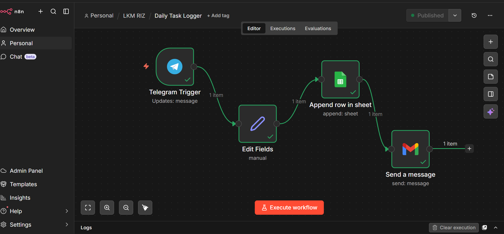

# Daily-Task-Logger

This workflow is a real-time task capture and tracking pipeline. It ensures that every task you send is instantly recorded and acknowledged.

It starts with a Telegram Trigger, where each message sent to the bot automatically initiates the workflow. Each message represents a task that needs to be tracked.

Instead of storing raw input, an Edit Fields node is used to structure and clean the data. This includes extracting the task content and converting the UNIX timestamp into a human-readable format.

Once the data is properly formatted, it is sent to Google Sheets, where each task is appended as a new row. This creates a continuously growing log of tasks that can be reviewed at any time.

Finally, a Gmail node sends a confirmation email, ensuring the user is notified that the task has been successfully logged.

### Purpose of workflow 
1. Capture tasks instantly from Telegram
2. Store tasks in a structured and accessible format
3. Provide confirmation notifications to avoid missed tasks

### Why This Is Powerful?
1. Eliminates the need for manual task entry
2. Ensures no task is forgotten through instant logging and alerts
3. Creates a simple but effective task management system with minimal setup

